********
Examples
********
Self-organizing maps are computationally intensive to train, especially
if the original space is high-dimensional or the map is large. Very
large maps where the number of neurons is at least five times the number
of data points are sometimes called emergent-self organizing maps --
these are especially demanding to train.
Somoclu is a highly
efficient, parallel and distributed algorithm to train such maps, and
its Python interface was recently updated. This enables fast training of
self-organizing maps on multicore CPUs or a GPU from Python, albeit only
on dense data, and the distributed computing capability is also not
exposed. The Python interface also lets you process the output files of
the command-line version, so if the data is sparse or the map was
trained on a cluster, you can still use the module for visualization.
Here we take a quick look at how to train and visualize a small map.

First, we import the necessary modules:

.. code:: python

    import numpy as np
    import matplotlib.pyplot as plt
    from mpl_toolkits.mplot3d import Axes3D
    import somoclu
    %matplotlib inline

Then we generate and plot some random data in three categories:

.. code:: python

    c1 = np.random.rand(50, 3)/5
    c2 = (0.6, 0.1, 0.05) + np.random.rand(50, 3)/5
    c3 = (0.4, 0.1, 0.7) + np.random.rand(50, 3)/5
    data = np.float32(np.concatenate((c1, c2, c3)))
    colors = ["red"] * 50
    colors.extend(["green"] * 50)
    colors.extend(["blue"] * 50)
    fig = plt.figure()
    ax = Axes3D(fig)
    ax.scatter(data[:, 0], data[:, 1], data[:, 2], c=colors)
    labels = range(150)

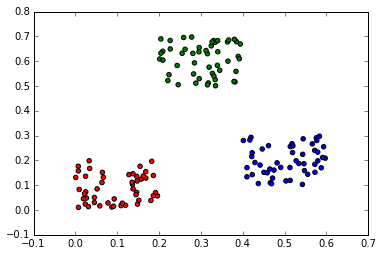

Planar maps
-----------

We train Somoclu with default parameter settings, asking for a large map
that qualifies as an emergent self-organizing map for this data:

.. code:: python

    n_rows, n_columns = 100, 160
    som = somoclu.Somoclu(n_columns, n_rows, compactsupport=False)
    %time som.train(data)

.. parsed-literal::

    CPU times: user 6.99 s, sys: 3.33 ms, total: 6.99 s
    Wall time: 5.21 s

We plot the component planes of the trained codebook of the ESOM:

.. code:: python

    som.view_component_planes()

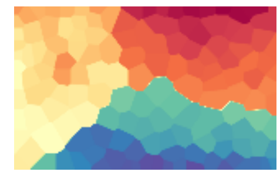

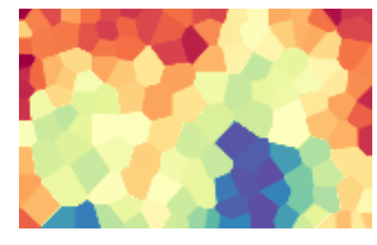

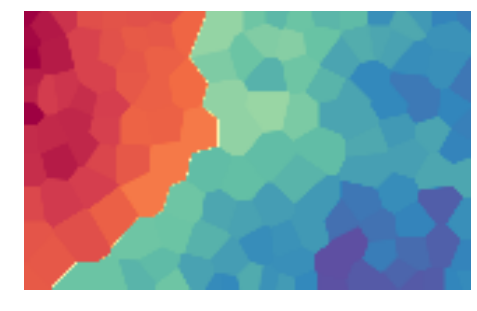

.. parsed-literal::

    <module 'matplotlib.pyplot' from '/usr/lib/python3.5/site-packages/matplotlib/pyplot.py'>

We can plot the U-Matrix, together with the best matching units for each
data point. We color code the units with the classes of the data points
and also add the labels of the data points.

.. code:: python

    som.view_umatrix(bestmatches=True, bestmatchcolors=colors, labels=labels)

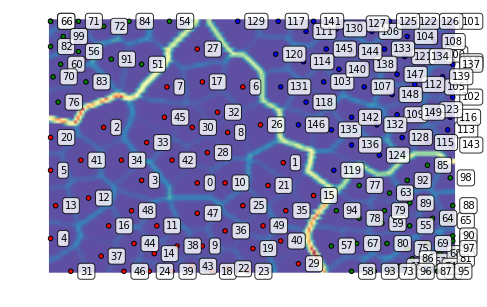

.. parsed-literal::

    <module 'matplotlib.pyplot' from '/usr/lib/python3.5/site-packages/matplotlib/pyplot.py'>

We can also zoom into a region of interest, for instance, the dense
lower right corner:

.. code:: python

    som.view_umatrix(bestmatches=True, bestmatchcolors=colors, labels=labels,
                     zoom=((50, n_rows), (100, n_columns)))

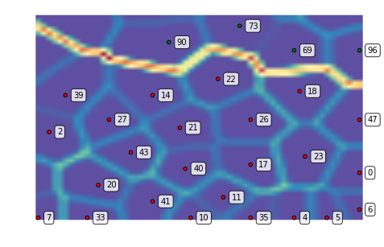

.. parsed-literal::

    <module 'matplotlib.pyplot' from '/usr/lib/python3.5/site-packages/matplotlib/pyplot.py'>

Toroid topology, hexagonal grid
-------------------------------

We can repeat the above with a toroid topology by specifying the map
type as follows:

.. code:: python

    som = somoclu.Somoclu(n_columns, n_rows, maptype="toroid",
                          compactsupport=False)
    som.train(data)
    som.view_umatrix(bestmatches=True, bestmatchcolors=colors)

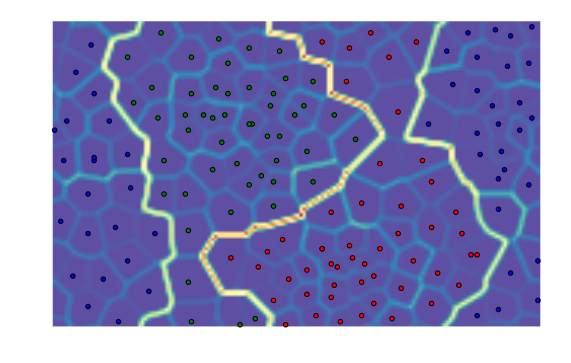

.. parsed-literal::

    <module 'matplotlib.pyplot' from '/usr/lib/python3.5/site-packages/matplotlib/pyplot.py'>

Notice how the edges of the map connect to the other side. Hexagonal
neurons are also implemented:

.. code:: python

    som = somoclu.Somoclu(n_columns, n_rows, gridtype="hexagonal",
                          compactsupport=False)
    som.train(data)
    som.view_umatrix(bestmatches=True, bestmatchcolors=colors)

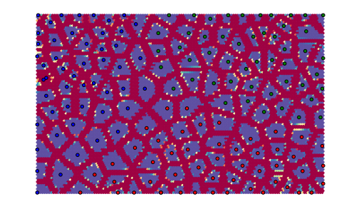

.. parsed-literal::

    <module 'matplotlib.pyplot' from '/usr/lib/python3.5/site-packages/matplotlib/pyplot.py'>

The separation of the individual points is more marked with these
neurons.

Initialization with principal component analysis and clustering the results
---------------------------------------------------------------------------

We can pass an initial codebook of our choice, but we can also ask
Somoclu to initialize the codebook with vectors from the subspace
spanned by the first two eigenvalues of the correlation matrix. To do
this, we need to pass an optional argument to the constructor:

.. code:: python

    som = somoclu.Somoclu(n_columns, n_rows, maptype="toroid",
                          compactsupport=False, initialization="pca")
    som.train(data)
    som.view_umatrix(bestmatches=True, bestmatchcolors=colors)

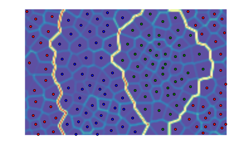

.. parsed-literal::

    <module 'matplotlib.pyplot' from '/usr/lib/python3.5/site-packages/matplotlib/pyplot.py'>

While one would expect entirely deterministic results on repeated runs
with the initialization based on PCA, this is not the case. The order in
which the data instances arrive matters: since Somoclu uses multiple
cores, there is no control over the order of each batch, hence the maps
will show small variation even with a PCA initalization.

We can also postprocess the codebook with an arbitrary clustering
algorithm that is included in
`scikit-learn <http://scikit-learn.org/stable/modules/classes.html#module-sklearn.cluster>`__.
The default algorithm is K-means with eight clusters. After clustering,
the labels for each node are available in the SOM object in the
``clusters`` class variable. If we do not pass colors to the matrix
viewing functions and clustering is already done, the plotting routines
automatically color the best matching units according to the clustering
structure.

.. code:: python

    som.cluster()
    som.view_umatrix(bestmatches=True)

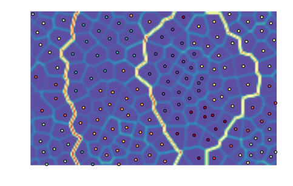

.. parsed-literal::

    <module 'matplotlib.pyplot' from '/usr/lib/python3.5/site-packages/matplotlib/pyplot.py'>

We can, of course, choose another clustering algorithm, but topological
clustering methods will make little sense with their default
parameterization. DBSCAN, for instance, will assign the same class to
all nodes:

.. code:: python

    from sklearn.cluster import DBSCAN
    algorithm = DBSCAN()
    som.cluster(algorithm=algorithm)
    som.view_umatrix(bestmatches=True)

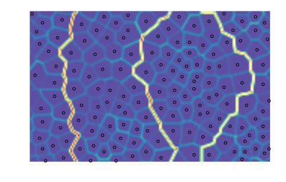

.. parsed-literal::

    <module 'matplotlib.pyplot' from '/usr/lib/python3.5/site-packages/matplotlib/pyplot.py'>

Evolving maps
-------------

One of the great advantages of self-organizing maps is that they are
incremental, they can be updated with new data. This is especially
interesting if the data points retain their old label, that is, the
properties of the vectors change in the high-dimensional space. Let us
train again a toroid rectangular emergent map on the same data:

.. code:: python

    som = somoclu.Somoclu(n_columns, n_rows, maptype="toroid")
    som.train(data)

Next, let us assume that the green cluster moves to the left, the other
points remaining invariant:

.. code:: python

    c2_shifted = c2 - 0.2
    updated_data = np.float32(np.concatenate((c1, c2_shifted, c3)))
    fig = plt.figure()
    ax = Axes3D(fig)
    ax.scatter(updated_data[:, 0], updated_data[:, 1], updated_data[:, 2], c=colors)

.. parsed-literal::

    <mpl_toolkits.mplot3d.art3d.Path3DCollection at 0x7fc9cf752470>

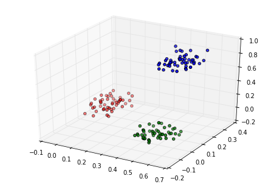

We can update the map to reflect this shift. We plot the map before and
after continuing the training:

.. code:: python

    som.view_umatrix(bestmatches=True, bestmatchcolors=colors, labels=labels)
    som.update_data(updated_data)
    som.train(epochs=2, radius0=20, scale0=0.02)
    som.view_umatrix(bestmatches=True, bestmatchcolors=colors, labels=labels)

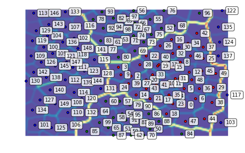

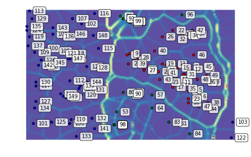

.. parsed-literal::

    <module 'matplotlib.pyplot' from '/usr/lib/python3.5/site-packages/matplotlib/pyplot.py'>

As a result of the shift, the blue points do not move around much. On
the other hand, the relationship of the red and green clusters is being
redefined as their coordinates inched closer in the original space.
